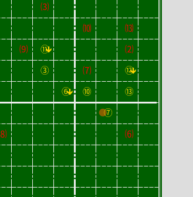

# BBReplay

BBReplay is a library for parsing and processing Blood Bowl 1 replay files. It turns them
into a sequence of actions and other details about the game.

## Running BBReplay

All BBReplay scripts need a log file and a replay database. The database provides the team details and the user commands, while the log file provides the results of rolls.

Each script has a `--help` option that describes the arguments that it takes.

Note that there must be one log per replay. If you run Blood Bowl, play one game (or watch one replay) and quit then you can copy the log from `My Documents/BloodBowlChaos/BB_Chaos000.log` and the replay from `My Documents/BloodBowlChaos/Saves/Replays-<date>_<time>.db`. If you have played multiple games or replays then use `get-replays.py` to split the log and save the associated replay files.

When watching replays, press the <kbd>+</kbd> key to speed up the replay and the <kbd>-</kbd> key to slow it down.

###  Game maps

The `map.py` prints Unicode maps of the game progress. By default it prints a sequence of maps for setup, kick-off, and at the end of each turn.

The `--pretty` switch adds ANSI escape sequences to draw colourful maps (requires a terminal that supports ANSI sequences - if you see `[38:5` in the output then your terminal *does not* support ANSI sequences).

The `--animate` switch uses more ANSI commands to redraw the prettified map after each action, providing a blow-by-blow recreation of the turn.

The `--from` switch lets you start the replay from a specific turn, which can be useful for animating the later turns of a match.

### Raw data dumps

`dump-data.py` prints all of the data that the library can extract from the data files. It prints a list of commands, a list of log entries, and then prints a list of combined events. This stream of events is what builds the [game maps](#game-maps).

This is intended as a developer tool to help people see the events that they will receive when they use the library.

## Dependencies

BBReplay uses only core Python 3 packages.

Linux users will already have Python available.

Windows users will need to install [Python 3 for Windows](https://www.python.org/downloads/windows/) or [Anaconda Individual Edition](https://www.anaconda.com/products/individual).

## Developer Documentation

The game replay files are SQLite database files, and the commands are included in the `Replay_NetCommands` table.

The [Docs](docs) directory contains more details about the replay file format.

## Known problems

* Setup actions are sometimes missing for some players
  * AI in exhibition matches
  * Human coach's players in exhibition match (may be default positioning)
* Some kick-off events don't give all details
  * e.g. "Brilliant Coaching" happens but doesn't say who gets rerolls
